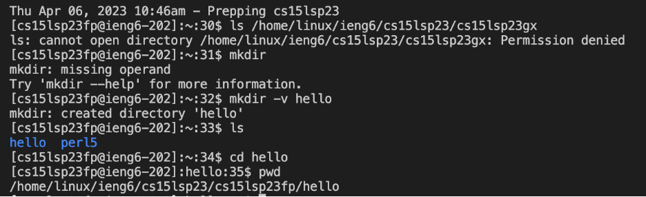

# Lab Report 1 - Remote Access and Filesystem

*Set your password*

If it is your first time logging in, you would first need to reset your password. 
You can find basic account infromation with this link here, [Link](https://sdacs.ucsd.edu/~icc/index.php.) 
Here, you will find instructions to reset your account password which we will use later during the lab. 

*Installing VS Code*


Thankfully on school computers, visual studio code is already installed for us to use. 
In the case as to where I would have to use my own laptop, instructions are straightforward and simple. 
Remember to install git before attempting to remotely connect to the server.
You could download VScode on your own devices with this link here, [Link](https://code.visualstudio.com/)

*Remotely Connecting*


Remember to use gitbash for the terminal we installed.
Then to login, type the command ``` ssh cs15lsp23gx@ieng6.ucsd.edu ``` after the dollar sign.
Then enter your own password and you should be perfectly logged in.

*Trying some Commands*


At this point, we are free to run some commands we learned in class and whatnot.
Some of these might not make immediate sense to us right now, but down the line I feel like we'll understand it better.
Simple commands such as ```CD```, ```mkdir```, ```ls```, ```cat```, and ```pwd```  are all familiar to us from different classes.
As a refresher, ```CD``` or "change directory" is used to change the current working directory into a given path.
```mkdir ``` is known as "make directory", which as the name suggests, makes a new directory.
```ls``` or "list" is known to list the files and folders within the given path.
```pwd``` is short for "print working directory" which simply displays the current working directory.
```cat``` is used to print the contents of one or more files given by the listed paths. 



