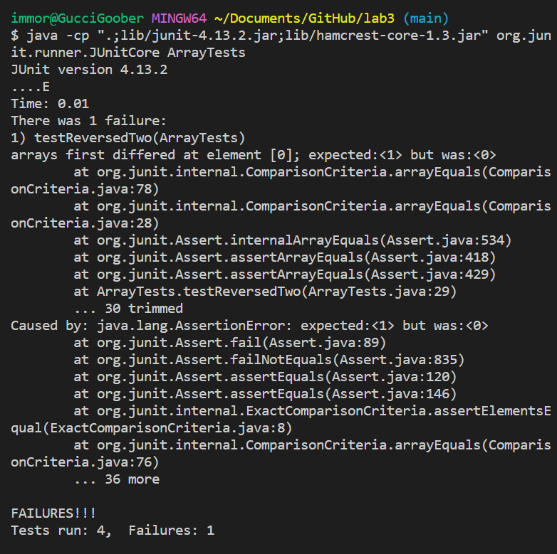

# Lab Report 2 - Servers and Bugs (Week 3)

## Part 1

* Once our code is complete, the next step is to run it inside the terminal with commands.
* Open the terminal with ```Ctrl + ~```
* Type the following commands:
```javac Server.java StringServer.java```
```java StringServer 4005```
* This would be the ideal output shown below. 

* Here is me testing two test cases, named test1 and test2 respectively.

* Which methods in your code are called?
  In terms of the method, the part that is called is the ```String[] parameters = url.getQuery().split("=");
            String y;
            if(x != null)
                {
                    y = x + "\n" + parameters[1];
                    return y;
                }
            x = parameters[1];
            return x;
        } ```
* What are the relevant arguemnts to those methods, and the value of any relevant fields of the class?
   In terms of this class, the most relevant field for the argument is the ```<string>``` part of the ```/add-message?s=<string>```
* How do the values of any relevant fields of the class change from this specific request? If no values got changed, explain why?
   I believe that in terms of this specific example, as shown by the ```y = x + "\n" + parameters[1];```, the added messages are added onto the previous string in order to maintain the previous string as an output.

* Which methods in your code are called?
  In terms of the method, the part that is called is the ```String[] parameters = url.getQuery().split("=");
            String y;
            if(x != null)
                {
                    y = x + "\n" + parameters[1];
                    return y;
                }
            x = parameters[1];
            return x;
        } ```
* What are the relevant arguemnts to those methods, and the value of any relevant fields of the class?
   In terms of this class, the most relevant field for the argument is the ```<string>``` part of the ```/add-message?s=<string>```
* How do the values of any relevant fields of the class change from this specific request? If no values got changed, explain why?
   I believe that in terms of this specific example, as shown by the ```y = x + "\n" + parameters[1];```, the added messages are added onto the previous string in order to maintain the previous string as an output.

## Part 2 
* Failure Inducing Bug
```
  public void testReverseInPlaceTwo() {
    int[] input1 = {1, 2, 3, 4, 5, 6, 7, 8};
    ArrayExamples.reverseInPlace(input1);
    assertArrayEquals(new int[]{8, 7, 6, 5, 4, 3, 2, 1}, input1);
  }
```
* Input that Does not Induce a Failure
```
	public void testReverseInPlace() {
    int[] input1 = { 3 };
    ArrayExamples.reverseInPlace(input1);
    assertArrayEquals(new int[]{ 3 }, input1);
	}
```
* Screenshot of the Symptom

* Before Code Change
```
static int[] reversed(int[] arr) {
int[] newArray = new int[arr.length];
for(int i = 0; i < arr.length; i+= 1) {
arr[i] = newArray[arr.length - i - 1];
}
return arr;
}
```
* After Code Change
```
static int[] reversed(int[] arr) {
int[] Array2 = new int[arr.length];
for(int i = 0; i < arr.length; i += 1) {
Array2[i] = arr[arr.length - i - 1];
}
return Array2;
}
```
* How this fixes the issue?
The way I tried to solve this was by instead of looping it through a new array, I looped it through my old array but in verse and directed those new values into the new array and just returned the new array directly. This makes sure that the new array gets filled up with values from the first array but in reverse. 

## Part 3
The last time I took Java, was at an somewhat entry level course in high school. The strategies and tools that were taught in that class was very basic and simplistic. However, over these past two weeks, from both lecture, lab, and personal studies, I have learned immense amounts about the Java language. One of the most prevalant things I learned for sure was about how to create my own web server. This was something I thought was very advanced before I took this class, and now I found out that it is pretty simple in comparison to everything else. Another thing I learned these past two weeks was abouth how to properly make and run our own test cases. In high school, the Java programs we used involved using an automated test case tester written by the teacher. However, now, I am able to not only write my own test cases but also adapt my code and fix it based off different test cases that I write myself. 
