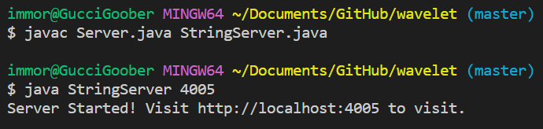
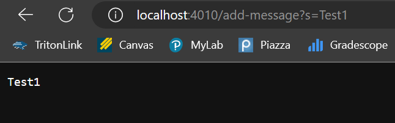
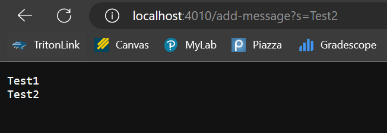

# Lab Report 2 - Servers and Bugs (Week 3)

## Part 1

* Once our code is complete, the next step is to run it inside the terminal with commands.
* Open the terminal with ```Ctrl + ~```
* Type the following commands:
```javac Server.java StringServer.java```
```java StringServer 4005```
* This would be the ideal output shown below. 

* Here is me testing two test cases, named test1 and test2 respectively.



**Part 2**
