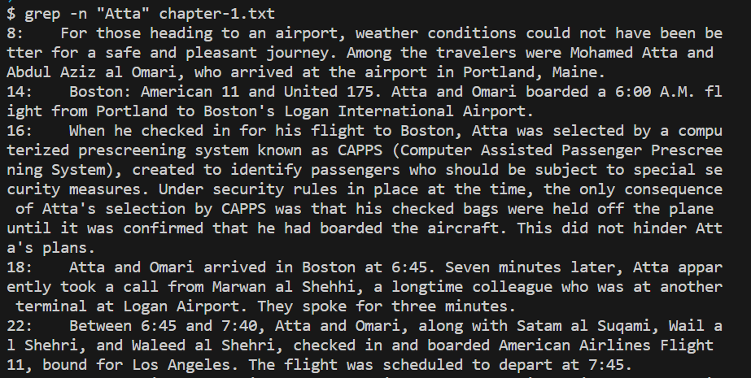
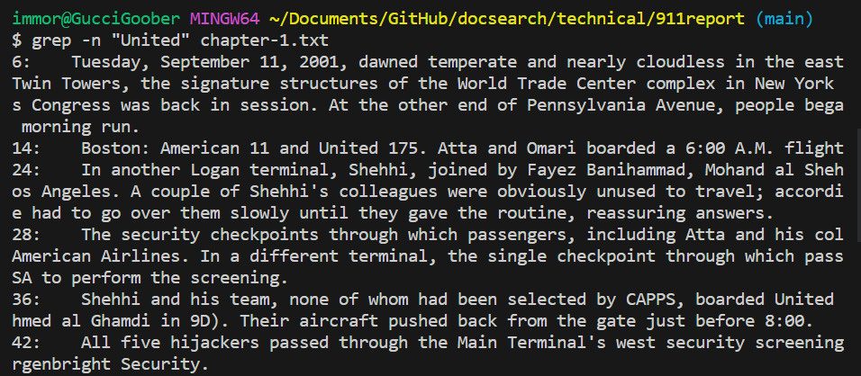
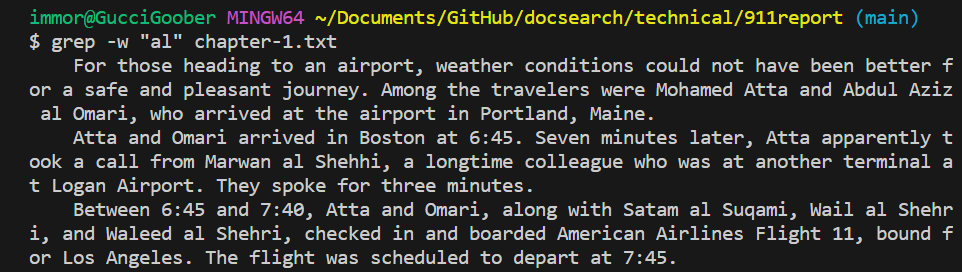
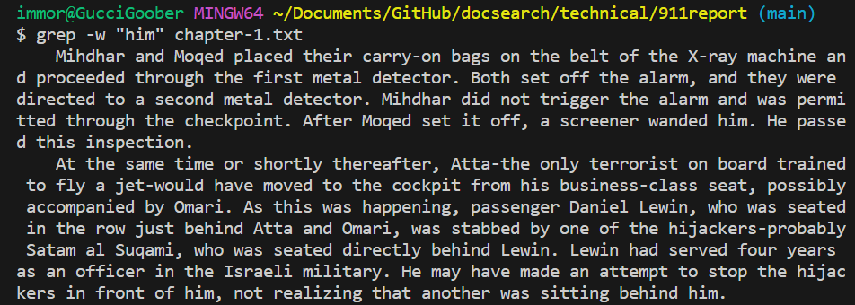
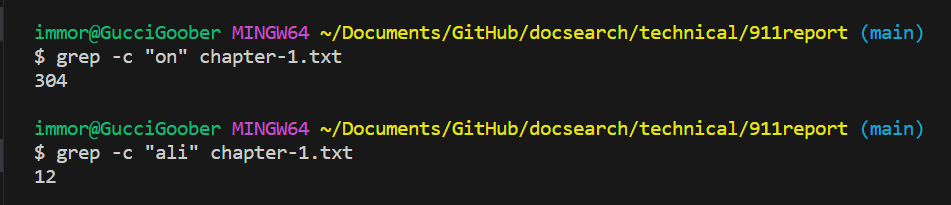
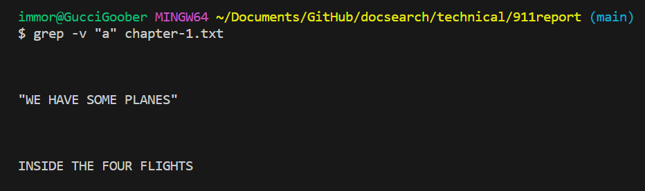
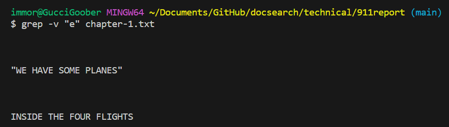

# Lab Report 3 - Researching Commands (Week 5) 
I'll be using the command line ```grep``` in order to find more options
## Command-line Option 1
The first command-line option I chose to test out was adding a ```-n```. This basically displays the matched lines as well as the exact line number in which it is found. Below are two examples of me using this feature within the ```technical/911report``` directory. 

First Example

Second Example

Not only is the basic grep function already very very useful, this also enables us to directly find exactly which line the words are found on. This could be useful in scenarios such as debugging or whatnot where there is a hefty amount of words/lines where this desired information might be difficult to find. I found this first option on [Link](https://www.geeksforgeeks.org/grep-command-in-unixlinux/)

## Command-line Option 2
The second command-line option I chose to test out was adding ```-w```. What this essentially does is that it looks for words that match the whole word. Below are two examples of me using this feature within the ```technical/911report``` directory. 

First Example

Second Example

This basically enables us to find whole words inside a long text files. Words such as ```hi``` or ```all``` sometimes appears in conjuction with other words such as ```him``` or ```fall```. Having this feature enables us to look for whole words specifically and those that are not in the substring of another word. I found this second option on [Link](https://www.geeksforgeeks.org/grep-command-in-unixlinux/)

## Command-line Option 3
The third command-line option I chose to test out was adding the ```-c```. What this does is basically simply returns a count of the total matched lines withouth returning an output of the strings itself. Below are two examples of me using this feature within the ```technical/911report``` directory. 


This is very useful as it can just directly tell us how many lines a certain string appears in a file. Yes, there are alternative ways to do this, however with this shortcut, I think that it is way more effcient as well as clean in terms of not cluttering up my terminal. 
I found this third option on [Link](https://www.geeksforgeeks.org/grep-command-in-unixlinux/)

## Command-line Option 4
The fourth command-line option I chose to test out was adding the ```-v```. What this does is that it basically prints out all the lines that actually do not follow this pattern, sort of like an inverse search. Below are two examples of me using this feature within the ```technical/911report``` directory. 

First Example

Second Example

I think that this is very useful as it is sort of like an opposite to what we know ```grep``` to be able to do. In the cases in which we have to find the lines that don't include a specific word, than this command right here would prove to be extremely useful. 
I found this third option on [Link](https://www.geeksforgeeks.org/grep-command-in-unixlinux/)
